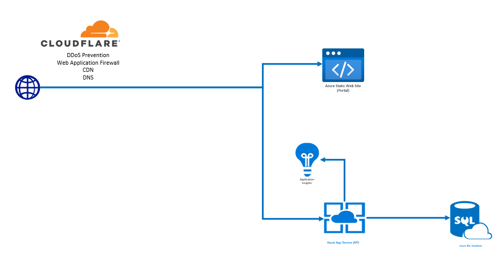

# SurveySiteDemoPortal

## Table of Contents

- [@MOM Survey Site Demo App](#mom-survey-site-demo)
  - [Overview](#overview)
  - [Setup](#setup)
    - [Prerequisites](#prerequisites)
    - [Repository](#repository)
  - [Build Process](#build-process)
  - [Deploy to Azure](#deploy-portal)
  - [Network Setup](#network-setup)

## Overview

This project is a demonstration site for My Opinion Matters. The site is a basic survey site. When a user hits the /survey endpoint the portal will make a request to the API for a new survey.
If the user is anonymous, the IP Address will be used to determine if the user has completed all the surveys for the day. If they are logged in, then their user identifier will be used.

The survey system consists of multiple "survey banks" e.g. Political Questions/General Questions etc. In each bank, there are a set number of questions. For each question there are multiple choice answers. 

The question bank will be choosen at random. The associated questions and the current scores will be gatehered together and returned back to the portal on the inital survey load.

As the user answers each question, an API call is made to save the response for that question. The user then sees the current score for the answers of the question.

When all questions are completed, the user will be asked if they want to log-in or sign up. If they are already logged in, they will get a message saying they have completed the survey.

If the user refreshes the page, they will get another question bank and so-on until all question banks are complete for that day. Once all banks are complete for the day, the user will get a message saying they are finished for the day.

## Setup

### Prerequisites

Please install the following tools and packages to run the apps:

- Node.js 18.x [download](https://nodejs.org/en/download/)
- Git [download](https://git-scm.com/downloads)
- `npm i -g @angular/cli`
  _Run the command above using a terminal_
- Your preffered code editor: [Visual Studio Code](https://code.visualstudio.com/), [Atom](https://atom.io/), [Vim](https://www.vim.org/), etc.

### Repository

Get the latest code from the [Repo](https://momsurveysite@dev.azure.com/momsurveysite/SurveySiteDemo/_git/SurveySiteDemo) repository.
When cloning the repository, make sure that you don't have spaces in the path to the repo

- Run the command `npm i` to begin installing the required packages
- Run the command `ng serve` to run the application. It will the be avialable on http://localhost:4200

### Build Process

To build the portal for production run the command `npm run build --prod`. This will generate a dist file in /dist/survey-site-demo-portal

### Deploy Portal

To deploy the portal to the Azure website go to the [DevOps pipelines](https://dev.azure.com/momsurveysite/SurveySiteDemo/_build) and run the `CD - Angular Web Portal` pipeline. It will deploy the angular files to azure.

### Network Setup

The application is deployed using Azure. The site is protected by Cloudflare on the front, and then proxied through to a static Azure Web Site for the angular portal and an App Service for the API. The deployed URL is [https://momsurveysitedemo.com/](https://momsurveysitedemo.com/) and the API is [https://api.momsurveysitedemo.com/api/](https://api.momsurveysitedemo.com/api/)

The following is a network diagram that depicts the network

### API Configuration

By default the API will run locally on [https://localhost:7214/api/](https://localhost:7214/api/). If this changes, go to /src/app/environments/environment.development.ts and change the value there to reflect your new API URL